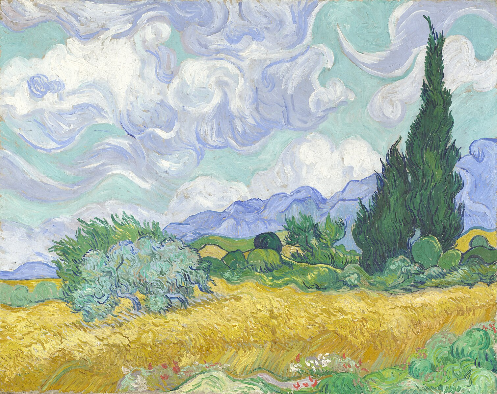
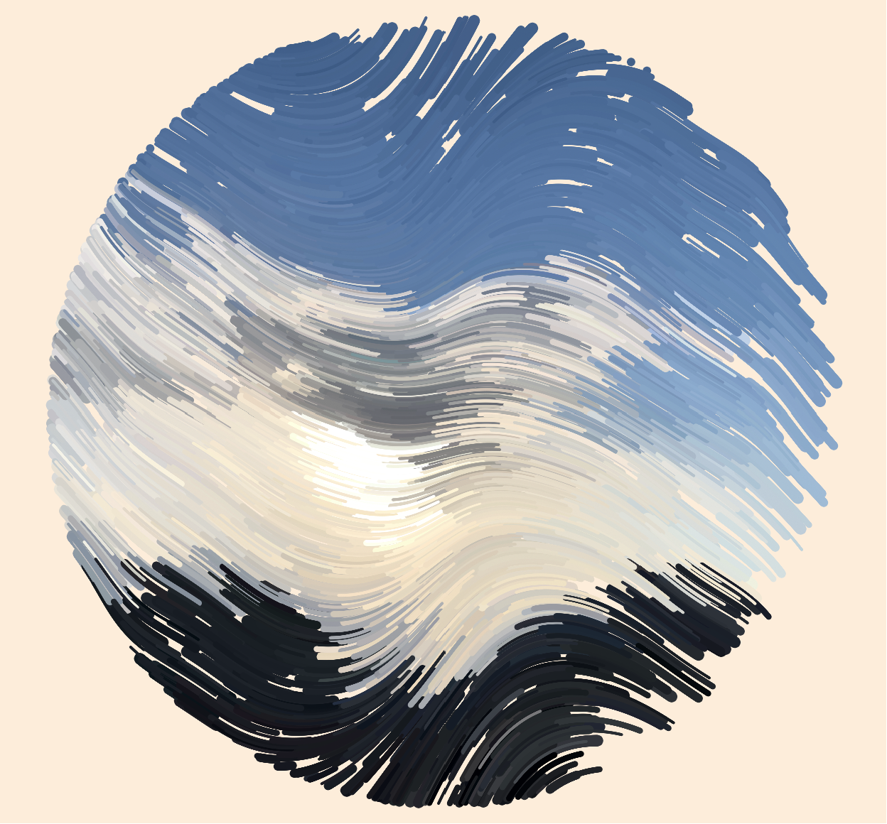

# bliu0480_9103_tut05

## This is my week8 quiz!
### Major Assignment Design Research

**Part 1:lmaging Technique Inspiration**

The artworks I found, *Wheat Field with Crows* and *Wheat Field with Cypresses* by Vincent van Gogh, are characterized by vibrant colors and distinct brushstrokes that immediately catch the viewer's attention. 

**Wheat Field with Cypresses**

**Wheat Field with Crows**

This unique brushwork reminds me of **particle animation**, a technique that combines numerous tiny elements. These particles can be arranged using data like position, color, and speed to simulate various forms. In both paintings, particle animation could express Van Gogh's distinctive brushstrokes, such as the skies and cypress trees.

---

**Part 2:Coding Technique Exploration**

In this existing code, Particle Animation is used, where small particles combine into an artwork through different colors and motion paths. With each refresh, a new composition is formed.[Sample Code](https://openprocessing.org/sketch/2232980)

As mentioned in the first part, we can express the brushstrokes of a painting by coding particle positions, paths, and colors, and upon refreshing, the brushstrokes also refresh while retaining the motion path. However, the colors can be altered to enrich the visual effect. For *Wheat Field with Cypresses*, we could have the particles move continuously along a path, mimicking the wind-swept movement of the cypress trees in the painting.

---

***Conclusion***

I wanted to use **Particle Animation** to achieve special strokes in the artwork, incorporating particle dynamics and color to achieve the final effect, and I think this effect will play a role in our final work.