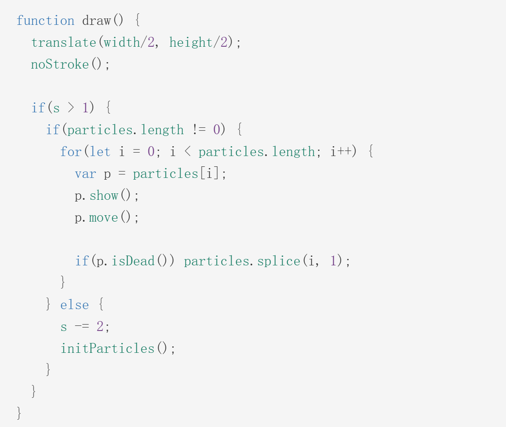

### Interactive Statement:

This code contains four main types of interaction:

- Press A to make particles move according to Perlin noise.
- Press B to return the screen to the original code effect.
- Press C to make sky particles change size based on Perlin noise.
- Press D to randomly generate colors for the house.

I chose Perlin noise to drive my personal code. In our group project, we divided the code into three main sections: sky, water, and house.

1. I adjusted the particle size in the sky section because I felt that finer particles would move more vividly, better replicating the original brushstrokes.
2. Although each of us focused on the motion of the sky and water, the movement styles are quite different. I emphasized particle trails and random sizes, allowing for manual control.
3. Besides movement based on Perlin noise, I added a random color option to generate colors randomly for the house, while the background changes to black, white, and gray, creating a black-and-white TV effect.
4. I incorporated some keyboard controls, allowing several different effects to coexist.

I mainly referred to the techniques in this code to create my particle motion effects, as mentioned in my Week 8 quiz.[Link to reference code](https://openprocessing.org/sketch/2232980)

I referred to the underlying logic of this code, specifically retrieving colors from the image and randomly updating particle positions via noise to achieve the desired effect.

1. This code first saves arrays and some basic data, loading and recording the image.

2. Then, the setup function sets up the canvas size and initializes basic information.

3. The draw function moves the coordinate origin to the canvas center, uses show( ) to draw particles, move( ) to control particle positions, and removes particles from the array if they die.

4. The initParticles function initializes all particles and extracts colors from the image.

5. mousePressed switches the image.

6. init( ) randomly generates the particles' initial position and direction, while move( ) controls their movement based on Perlin noise.

I retained the move( ), init( ), and class( ) portions from this code to replicate its displayed effects. I also applied our chosen image, reassigning colors to the particles and removing the original death condition. A new appearance condition was added: when mode=0, particles start moving irregularly based on noise, leaving trails when pressing A.

Similarly, I altered particle movement to change particle size, reusing the init( ) and class( ) portions to achieve the effect of particles changing size based on noise when pressing C. Otherwise, an introductory screen is displayed.

For the final effect, I didn't continue using Perlin noise. Instead, I used random color generation to create random colors. However, using random colors for the entire scene would be too chaotic, so I only applied it to the main house, making it colorful while setting the background to black, white, and gray. This effect is triggered when both conditions start=true and mode=2 (controlling color flashing) are met. Otherwise, the introductory screen is displayed.

### Reference List

p5.js. (n.d.). *lerpColor*. The Processing Foundation.https://p5js.org/zh-Hans/reference/p5/lerpColor/

p5.js. (n.d.). *keyPressed*. The Processing Foundation. https://p5js.org/zh-Hans/reference/p5/keyPressed/

p5.js. (n.d.). *Conditionals and interactivity*. The Processing Foundation. https://p5js.org/tutorials/conditionals-and-interactivity/

Torres.J.(2024).*Painting with Circle Noise-Fork.*
https://openprocessing.org/sketch/2232980
